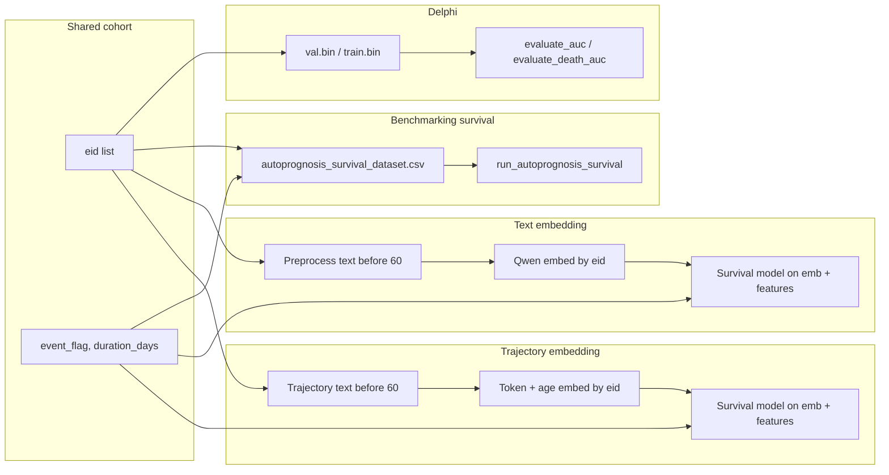

# Death Prediction Pipeline: Alignment and Evaluation Plan

## Research question (clarified)

Predict **death** (and optionally other events) using:

- **Input:** Patient features and **disease history before age 60**
- **Outcome:** Death after 60 (same as in [benchmarking/preprocess_survival.py](benchmarking/preprocess_survival.py): `event_flag`, `duration_days` from 60th birthday to event or censor)

All four methods must use the same **cohort** (same set of `eid`s) and the same **target** (death after 60) for comparable evaluation.

---

## Part 1: Can embedding method 1 and method 2 answer the research question?

### Method 1: Natural text embedding

- **Feasibility:** Yes. Convert **disease history before 60** (and optionally other baseline features) into natural language per patient, embed with Qwen, then use the embedding as features in a survival model predicting death after 60.
- **Requirements:** (1) Text must be restricted to information **before 60** (e.g. diagnoses and ages &lt; 60). (2) Outcome must be death after 60 (same as benchmarking). (3) Cohort must match (same `eid`s as survival dataset).
- **Gap:** Current [preprocessing/natural_text_conversion.py](preprocessing/natural_text_conversion.py) builds a general “clinical narrative” from many UKB fields and is not restricted to “before 60” or keyed to the survival cohort. [embedding/qwen_embedding.py](embedding/qwen_embedding.py) reads from `natural_text_train` and uses `patient_*` filenames; it does not merge by `eid` with the survival table.

### Method 2: Trajectory token + age embedding (Delphi-style)

- **Feasibility:** Yes. Generate a trajectory string per patient (e.g. `"0.0: Male\n2.0: B01 Varicella ...\n20.0: No event\n..."`) **truncated at 60 years**, then: (a) **token_embedding:** one vector per disease (e.g. from Qwen or a fixed lookup), (b) **age_embedding:** sin/cos encoding of age (as in [Delphi/model.py](Delphi/model.py) `AgeEncoding`), (c) combine (e.g. concat) and optionally pool over events, then concat with other baseline features and feed to a survival model.
- **Requirements:** (1) Trajectory only includes events before 60. (2) Same death-after-60 outcome and cohort. (3) Token vocabulary and age encoding defined so outputs are consistent.
- **Gap:** No current code produces Delphi-style trajectory **text** from [preprocessing/generate_disease_trajectory.py](preprocessing/generate_disease_trajectory.py) (which outputs an age-at-diagnosis matrix). There is no pipeline that embeds per-event tokens + ages and aggregates for survival.

**Conclusion:** Both methods can answer the research question provided: (1) inputs are explicitly “disease (and optionally other features) before 60”, (2) outcome is death after 60, (3) cohort and evaluation are aligned with the benchmarking survival setup.

---

## Part 2: Updates to embedding and preprocessing

### 2.1 Preprocessing


| Component                                            | Current state                                                                                                                                                                 | Required updates                                                                                                                                                                                                                                                                                                                                                                                                                                                                                                                    |
| ---------------------------------------------------- | ----------------------------------------------------------------------------------------------------------------------------------------------------------------------------- | ----------------------------------------------------------------------------------------------------------------------------------------------------------------------------------------------------------------------------------------------------------------------------------------------------------------------------------------------------------------------------------------------------------------------------------------------------------------------------------------------------------------------------------- |
| **Disease history before 60 as text (for method 1)** | [natural_text_conversion.py](preprocessing/natural_text_conversion.py) produces full clinical narrative from raw UKB; not restricted to before 60 or keyed to survival cohort | Add a mode or new entry point that: (1) takes [disease_before60_features.csv](benchmarking/disease_before60_features.csv) and optionally [data/preprocessed/disease_trajectory.csv](preprocessing/generate_disease_trajectory.py) (for ages), (2) produces one natural-language summary **per eid** restricted to “disease history before 60” (and optionally add key demographics from survival cohort), (3) outputs by `eid` (e.g. `eid_*.txt` or a CSV with `eid, text`) so embedding and survival can merge on `eid`.           |
| **Trajectory text for method 2**                     | [generate_disease_trajectory.py](preprocessing/generate_disease_trajectory.py) outputs a matrix of ages at diagnosis; no Delphi-style text                                    | Add a script or function that: (1) reads the same disease_trajectory (and demographics for Sex), (2) for each patient builds a trajectory string like `"0.0: Male\n2.0: B01 Varicella [chickenpox]\n...\n20.0: No event\n..."` with events **only before 60**, (3) outputs per-patient trajectory text keyed by `eid` (file or DataFrame). Use the same disease-name source as Delphi (e.g. [delphi_labels_chapters_colours_icd.csv](Delphi/evaluate_delphi.ipynb) or a mapping from variables.xlsx) so token names are consistent. |


- **Cohort alignment:** Both preprocessing outputs should be generated only for **eids** that appear in the survival dataset (e.g. from [autoprognosis_survival_dataset.csv](benchmarking/autoprognosis_survival_dataset.csv) or from the same sampling used in [preprocess_survival.py](benchmarking/preprocess_survival.py)), so train/val/test splits can be shared across all four methods.

### 2.2 Embedding


| Component                           | Current state                                                                                                      | Required updates                                                                                                                                                                                                                                                                                                                                                                                                                                                                                                                                                                                                                                                                                                                                                  |
| ----------------------------------- | ------------------------------------------------------------------------------------------------------------------ | ----------------------------------------------------------------------------------------------------------------------------------------------------------------------------------------------------------------------------------------------------------------------------------------------------------------------------------------------------------------------------------------------------------------------------------------------------------------------------------------------------------------------------------------------------------------------------------------------------------------------------------------------------------------------------------------------------------------------------------------------------------------- |
| **Qwen text embedding (method 1)**  | [qwen_embedding.py](embedding/qwen_embedding.py): reads `patient_*.txt`, outputs `patient_*` keys; paths hardcoded | (1) Support input directory or list of text files keyed by `eid` (e.g. `eid_12345.txt` or a CSV with `eid, text`). (2) Output embeddings keyed by `eid` (e.g. `embeddings_eid.npz` with keys as string eids) and a small metadata JSON (eid list, embedding dim). (3) Document or add a helper to merge with survival DataFrame on `eid`.                                                                                                                                                                                                                                                                                                                                                                                                                         |
| **Trajectory embedding (method 2)** | Not implemented                                                                                                    | New module (e.g. `embedding/trajectory_embedding.py` or under preprocessing): (1) **Input:** Per-patient trajectory text or structured list of `(age_years, disease_name)` before 60. (2) **Token embedding:** Either (a) embed each unique disease string with Qwen and cache, or (b) use a fixed list of disease names and embed once to form a lookup. (3) **Age embedding:** For each event, compute sin/cos encoding of age (same scheme as Delphi: e.g. `age_days` or `age_years * 365.25`). (4) **Combine:** e.g. `concat(age_embedding, token_embedding)` per event, then mean/max pool over events to get one vector per patient; optionally add a small learned aggregator. (5) Output by `eid` in the same format as method 1 for downstream survival. |


- **Config/paths:** Replace hardcoded paths in [qwen_embedding.py](embedding/qwen_embedding.py) with config or CLI args (input dir/list, output dir, optional eid list filter) so the same code can run on “disease before 60” text and, if desired, on full narratives for ablations.

---

## Part 3: Evaluation of the four aligned methods

### 3.1 Common setup

- **Cohort:** One shared list of `eid`s (e.g. from `autoprognosis_survival_dataset.csv` or from `preprocess_survival.py` with a fixed seed). Split once into train/val/test (e.g. 70/15/15).
- **Target:** `event_flag` (death), `duration_days` from 60th birthday. No change for benchmarking; for Delphi, ensure the same eids are in the val (and test) bin and that the evaluation uses “death after 60” (e.g. by restricting to trajectories truncated at 60 and evaluating the Death token at appropriate horizons).
- **Metrics:** Survival: C-index, time-dependent AUC, integrated Brier score; binary at fixed horizon(s): AUC, sensitivity/specificity. For Delphi, keep existing AUC (and DeLong) for the Death token; report same horizon(s) as other methods where possible.

### 3.2 Method-specific evaluation flow




- **Delphi:** Run [evaluate_auc.py](Delphi/evaluate_auc.py) or [evaluate_death_auc.ipynb](Delphi/evaluate_death_auc.ipynb) on val/test built from the same cohort; report Death-token AUC (and optionally calibration). If val.bin is not yet built from that cohort, add a step to build val/test bins from the shared eid list (using [respiratory_preprocess_delphi.ipynb](Delphi/data/respiratory_preprocess_delphi.ipynb)-style pipeline).
- **Benchmarking:** Filter [autoprognosis_survival_dataset.csv](benchmarking/autoprognosis_survival_dataset.csv) to the same train/val/test eids; train on train, evaluate on val/test. Use existing [run_autoprognosis_survival.py](benchmarking/run_autoprognosis_survival.py) / [evaluate_autoprognosis_survival.py](benchmarking/evaluate_autoprognosis_survival.py).
- **Text embedding (method 1):** For train eids, produce text (preprocessing), embed by eid, merge with baseline features and `event_flag`/`duration_days`. Train a survival model (e.g. AutoPrognosis or Cox) on embedding + features. Evaluate on val/test using same metrics.
- **Trajectory embedding (method 2):** Same as method 1, but features are the trajectory token+age embedding (and optionally same baseline features). Same survival model and evaluation.

### 3.3 Unified evaluation script/notebook

- Add a single entry point (script or notebook) that: (1) loads the shared cohort and train/val/test split, (2) runs or loads results for each of the four methods (Delphi, AutoPrognosis, text-embedding survival, trajectory-embedding survival), (3) computes the same metrics on the same test set and (4) outputs a comparison table and optional plots (e.g. AUC by method, C-index, calibration). This ensures alignment and reproducibility.

---

## Implementation order (suggested)

1. **Preprocessing for method 1:** Extend or add pipeline: disease-before-60 text per eid for the survival cohort; output keyed by eid.
2. **Preprocessing for method 2:** Add trajectory-to-text (Delphi format, truncated at 60) per eid for the same cohort.
3. **Embedding:** Update Qwen pipeline to eid-based I/O; implement trajectory token+age embedding module and output by eid.
4. **Cohort and splits:** Define shared eid list and train/val/test split; document or save (e.g. CSV or JSON) and use in all four pipelines.
5. **Delphi binary rebuild:** Rebuild `train.bin`, `val.bin`, `test.bin` from the shared cohort split so Delphi evaluation uses the exact same eids as all other methods.
6. **Delphi evaluation:** Run death-token AUC on the rebuilt val/test bins using `evaluate_delphi.py`.
7. **Benchmarking:** Restrict to same cohort/split; run and record metrics.
8. **Survival models for embedding methods:** Train survival models on embedding + baseline features; evaluate on val/test.
9. **Unified evaluation:** Implement the comparison script/notebook and produce the final table and figures.

---

## Execution runbook

All code is written. Run steps in order. Each step writes output files consumed by the next.

### Step 0 — Cohort split (prerequisite for everything)

```bash
python evaluation/cohort_split.py
# Output: evaluation/cohort_split.json
```

### Step 1 — Preprocessing: disease-before-60 text (method 1)

```bash
python preprocessing/natural_text_conversion.py --mode before60 \
    --disease-csv benchmarking/disease_before60_features.csv \
    --survival-csv benchmarking/autoprognosis_survival_dataset.csv \
    --cohort-json evaluation/cohort_split.json \
    --output-dir data/preprocessed/text_before60 \
    --output-csv data/preprocessed/text_before60.csv
# Output: data/preprocessed/text_before60.csv and per-eid eid_*.txt files
```

### Step 2 — Preprocessing: trajectory text (method 2)

```bash
python preprocessing/generate_trajectory_text.py
# Reads: data/preprocessed/disease_trajectory.csv + cohort_split.json
# Output: data/preprocessed/trajectory_before60.csv and per-eid eid_*.txt files
```

> **Note on disease name consistency:** `generate_trajectory_text.py` derives names from column slugs. For canonical Delphi-aligned names, pass `--labels-csv Delphi/delphi_labels_chapters_colours_icd.csv` if the script supports it, or post-process names against that CSV.

### Step 3a — Embed method 1 (Qwen text)

```bash
python embedding/qwen_embedding.py \
    --input-csv data/preprocessed/text_before60.csv \
    --output-dir data/preprocessed/embeddings_text \
    --model-name Qwen/Qwen3-Embedding-0.6B \
    --text-col text
# Output: data/preprocessed/embeddings_text/patient_embeddings.npz
```

### Step 3b — Embed method 2 (trajectory token+age)

```bash
python embedding/trajectory_embedding.py \
    --input-csv data/preprocessed/trajectory_before60.csv \
    --output-dir data/preprocessed/embeddings_traj \
    --token-mode random   # or --token-mode qwen for Qwen token embeddings
# Output: data/preprocessed/embeddings_traj/trajectory_embeddings.npz
```

### Step 4 — Rebuild Delphi binary data from shared cohort

**Script:** [`Delphi/preprocess_delphi_binary.py`](Delphi/preprocess_delphi_binary.py)

This replaces the old interactive notebook. It reads `disease_trajectory.csv` + `autoprognosis_survival_dataset.csv` + `cohort_split.json` and produces `train.bin`, `val.bin`, `test.bin` split by the shared eids.

```bash
python Delphi/preprocess_delphi_binary.py \
    --trajectory-csv data/preprocessed/disease_trajectory.csv \
    --survival-csv benchmarking/autoprognosis_survival_dataset.csv \
    --labels-csv Delphi/delphi_labels_chapters_colours_icd.csv \
    --cohort-json evaluation/cohort_split.json \
    --output-dir Delphi/data/ukb_respiratory_data
# Output: Delphi/data/ukb_respiratory_data/{train,val,test,full}.bin
#         Delphi/data/ukb_respiratory_data/preprocessing_metadata.json
```

> **Why this matters:** Without this step, `evaluate_delphi.py` reads bins built from a different (or unknown) cohort, making cross-method comparison invalid.

### Step 5 — Evaluate Delphi

```bash
python evaluation/evaluate_delphi.py \
    --ckpt-path Delphi/Delphi-2M-respiratory/ckpt.pt \
    --data-path Delphi/data/ukb_respiratory_data \
    --split test \
    --cohort-json evaluation/cohort_split.json \
    --output-dir evaluation/delphi_results
# Output: evaluation/delphi_results/delphi_test_results.json
```

### Step 6 — Evaluate benchmarking (CoxPH baseline)

```bash
python evaluation/evaluate_benchmarking.py \
    --baseline-mode all \
    --output-dir evaluation/benchmarking_results
# Output: evaluation/benchmarking_results/benchmarking_results.json
```

### Step 7a — Evaluate text embedding survival

```bash
python evaluation/evaluate_embedding_survival.py \
    --embedding-dir data/preprocessed/embeddings_text \
    --tag patient \
    --method-name text_embedding \
    --output-dir evaluation/embedding_results
# Output: evaluation/embedding_results/text_embedding_results.json
```

### Step 7b — Evaluate trajectory embedding survival

```bash
python evaluation/evaluate_embedding_survival.py \
    --embedding-dir data/preprocessed/embeddings_traj \
    --tag trajectory \
    --method-name trajectory_embedding \
    --output-dir evaluation/embedding_results
# Output: evaluation/embedding_results/trajectory_embedding_results.json
```

### Step 8 — Unified comparison

```bash
python evaluation/unified_evaluation.py
# Output: evaluation/unified_comparison.csv, evaluation/unified_comparison.json
```

---

## File and data references

- **Survival target and cohort:** [benchmarking/preprocess_survival.py](benchmarking/preprocess_survival.py) (build_start_dates at 60, event_flag, duration_days), [benchmarking/autoprognosis_survival_dataset.csv](benchmarking/autoprognosis_survival_dataset.csv).
- **Disease before 60:** [benchmarking/disease_before60_features.csv](benchmarking/disease_before60_features.csv), [benchmarking/preprocess_diagnosis.py](benchmarking/preprocess_diagnosis.py).
- **Trajectory matrix:** [preprocessing/generate_disease_trajectory.py](preprocessing/generate_disease_trajectory.py) → `data/preprocessed/disease_trajectory.csv`.
- **Delphi format and death:** [Delphi/utils.py](Delphi/utils.py) (get_batch, get_p2i), [Delphi/model.py](Delphi/model.py) (AgeEncoding), [Delphi/evaluate_auc.py](Delphi/evaluate_auc.py), [Delphi/evaluate_death_auc.ipynb](Delphi/evaluate_death_auc.ipynb); Death token index 1268/1269 in labels.
- **Embedding:** [embedding/qwen_embedding.py](embedding/qwen_embedding.py), [embedding/GET_STARTED.md](embedding/GET_STARTED.md).
- **Natural text:** [preprocessing/natural_text_conversion.py](preprocessing/natural_text_conversion.py).

